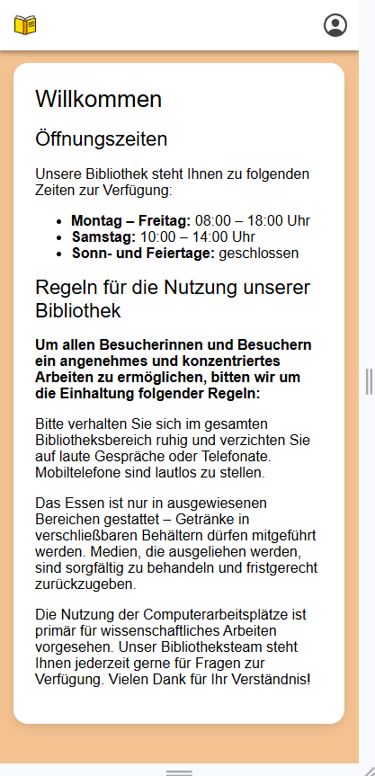
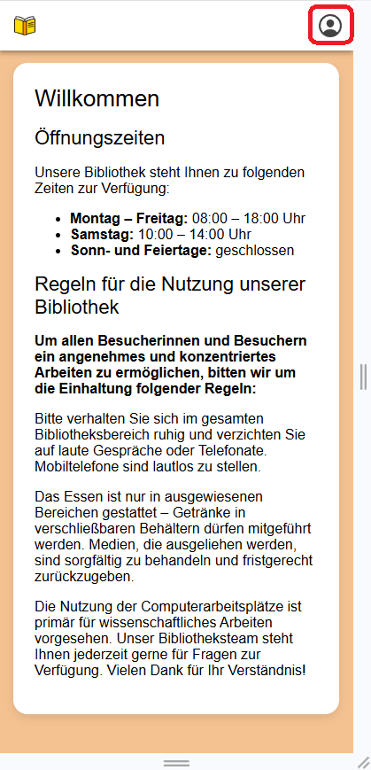
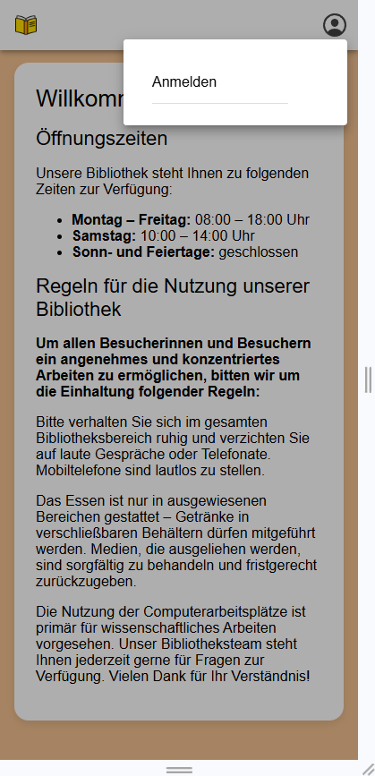
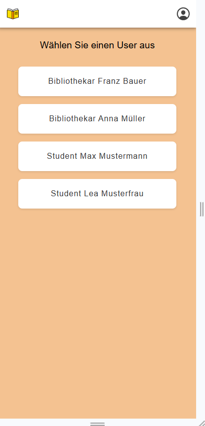
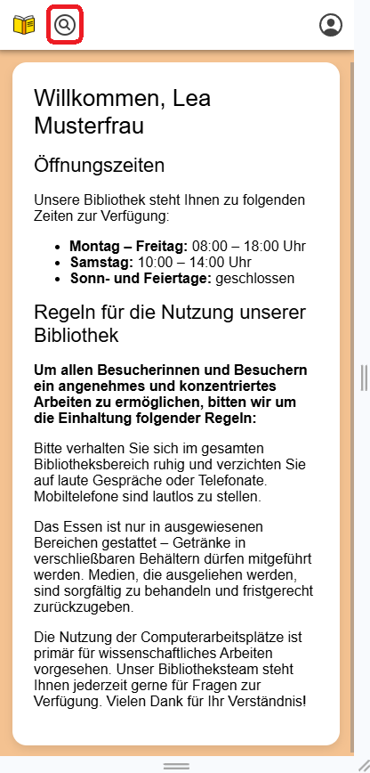
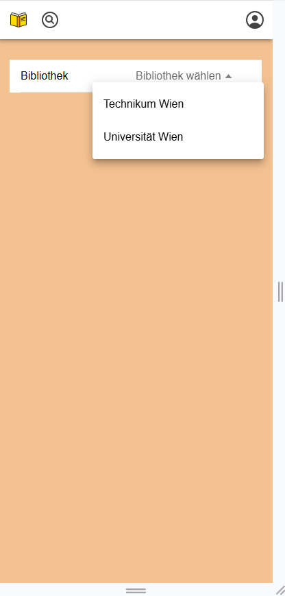
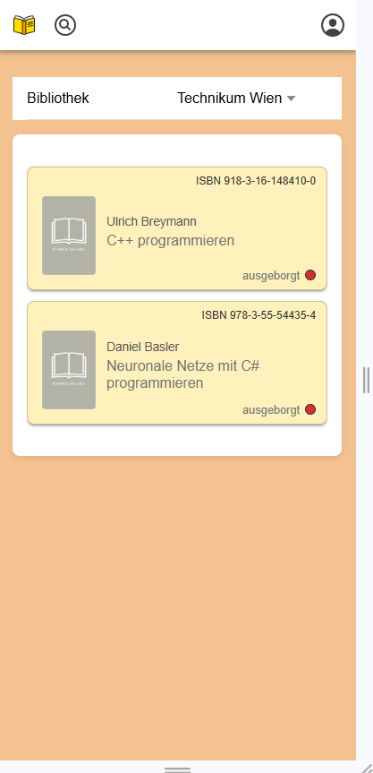
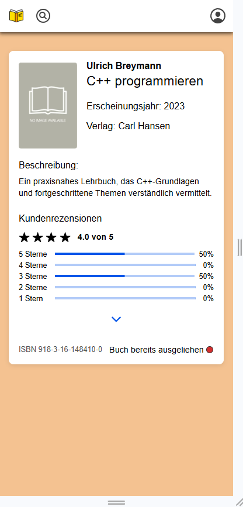
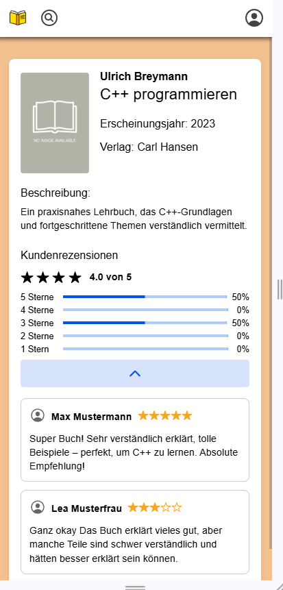

# Project Specification – Milestone 2

## Setup
* run docker-compose.yml to create db
* start backend: run LibraryBackendApplication
* start frontend- "ionic start"

---

## User Stories

- 🟦 **#1 – Static page (no backend)**
- 🟩 **#2–3 – GET endpoints with at least one relationship between two resources**

---

### 🟦 User Story #1 – Static

**Story:**  
As a visitor, I want to see general information about the library system (such as opening hours, and rules) so that I know how to use the services.
**Affected Resources:**  
*(none)*

**Planned Implementation (Frontend Component):**  
Static webpage

---

### 🟩 User Story #2 - Display Available Books

**Story:**  
As a user, I want to see a list of all available books in a library so that I can decide which one to borrow.

**Affected Resources:**  
`book`, `library`

**Planned Implementation (e.g., list view, detail view):**  
GET `/libraries/{id}/books`
Frontend: List view of books for a selected library, including availability status.

**Additional steps:**  
The user must be able to log in before accessing the search functionality.  
GET `/users`

---

### 🟩 User Story #3 - View book ratings

**Story:**  
As a user, I want to view the ratings and reviews of a book so that I can choose a highly rated one.

**Affected Resources:**  
`book`

**Planned Implementation:**  
GET `/books/{id}/ratings`
Frontend: Detail view of a book with aggregated ratings and user comments.

**Additional steps:**  
The book detail view must be opened first in order to view the ratings.  
GET `/books/{id}`

